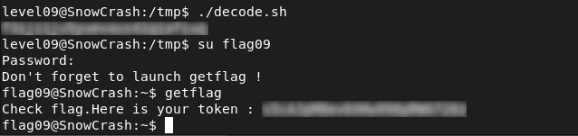

# Level09 – SnowCrash

## Objective
Reverse a custom transformation algorithm to recover the flag stored in file `token`.

## Reconnaissance
The home directory contains:
- An executable binary `level09`
- A file named `token`
Testing the binary with controlled input reveals a deterministic positional shift:
```bash
encrypted_char = original_char + index
```
Each character is incremented by its position in the string.
This indicates a simple, reversible encoding scheme rather than real encryption.

The `token` file contains non-printable bytes, suggesting it was processed using the same algorithm.

## Exploitation
To recover the original value:
```bash
original_char = encrypted_char - index
```
A Bash script was used to reverse the transformation byte-by-byte:
```bash
#!/bin/bash

i=0
token="66 34 6b 6d 6d 36 70 7c 3d 82 7f 70 82 6e 83 82 44 42 83 44 75 7b 7f 8c 89"

for byte in $token
do
    dec=$((16#$byte))
    orig=$(( (dec - i) & 255 ))
    printf "\\$(printf '%03o' "$orig")"
    ((i++))
done
echo
```
The script reconstructs the original clear-text flag.

## Flag


